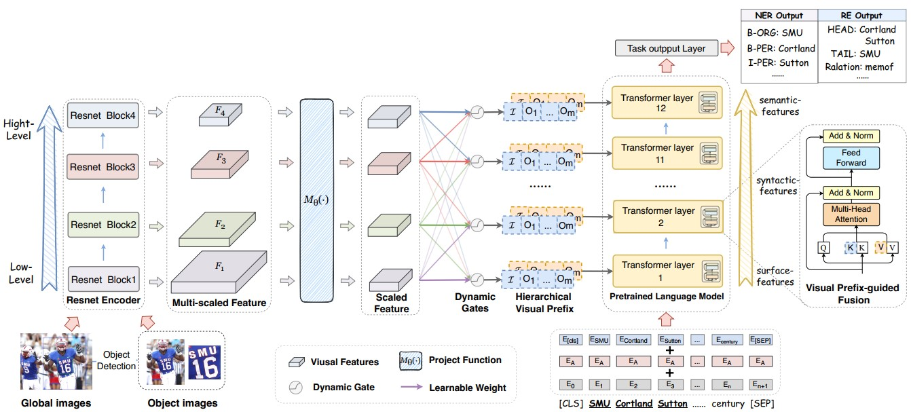
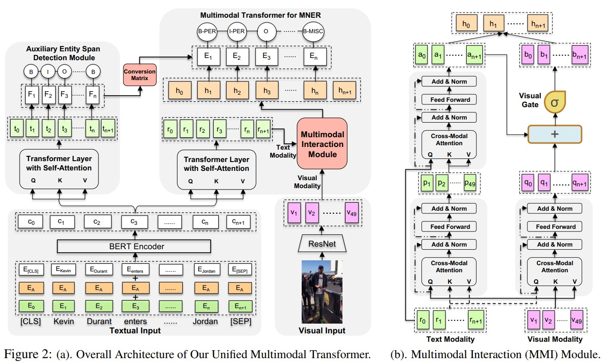
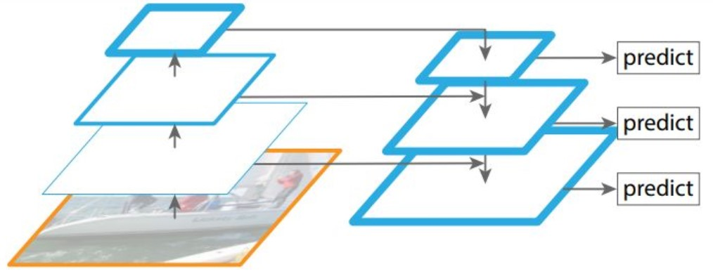

## Text-Vision Attention Network

## Text-Image Cross-Modal Fusion Attention Network

MAF: A General Matching and Alignment Framework for Multimodal Named Entity Recognition

WSDM 2022   (B类会议)

Multi-modal Graph Fusion for Named Entity Recognition with Targeted Visual Guidance

(AAAI 2021)

## ALL Model

RpBERT: A Text-image Relation Propagation-based BERT Model for Multimodal NER

Good Visual Guidance Makes A Better Extractor: Hierarchical Visual Prefix for Multimodal Entity and Relation Extraction

Adaptive Co-Attention Network for Named Entity Recognition in Tweets（2018）

CPT: COLORFUL PROMPT TUNING FOR PRE-TRAINED VISION-LANGUAGE MODELS

Improving Multimodal Named Entity Recognition via Entity Span Detection with Unified Multimodal Transformer

ITA: Image-Text Alignments for Multi-Modal Named Entity Recognition

## 图像特征提取可参考模型（FPN、PANet）

[Feature Pyramid Networks for Object Detection](https://arxiv.org/pdf/1612.03144.pdf)

[Path Aggregation Network for Instance Segmentation](https://arxiv.org/pdf/1803.01534.pdf)

[深入浅出Yolo系列之Yolov5核心基础知识完整讲解](https://zhuanlan.zhihu.com/p/172121380)

[YOLOv5代码详解]([YOLOv5代码详解（yolov5l.yaml部分）_Liaojiajia-2020的博客-CSDN博客_yolov5代码](https://blog.csdn.net/mary_0830/article/details/107124459?utm_medium=distribute.pc_relevant.none-task-blog-2~default~baidujs_baidulandingword~default-1-107124459-blog-123402998.pc_relevant_multi_platform_whitelistv1&spm=1001.2101.3001.4242.2&utm_relevant_index=3))

[进击的后浪yolov5深度可视化解析](https://zhuanlan.zhihu.com/p/183838757)

通道注意力和空间注意力
