# 机器学习算法 —— 回归Regression

### Stock Market Forecast（股票市场预测）

<!-- 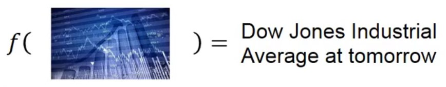 -->

- Input：过去十年股票起伏信息、股票相关公司的并购资料

- Output：预测未来股票市场指数平均值（Dow Jones Industrial Average）

### Self-driving Car（无人驾驶）

<!-- 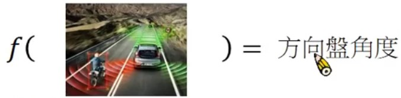 -->

- Input：汽车各种传感器所采集的数据，如超声波距离传感器、激光雷达、图像摄像头等

- Output：方向盘角度或者目前车辆行驶速度

### Recommendation（推荐系统）

<!-- 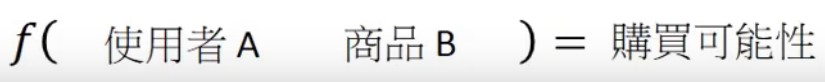 -->

- Input：使用者A的购买习惯，商品B的特性

- Output：使用者A购买商品B的可能性

### 预测Pokeman的CP(Combat Power)指标

- Input：进化前的CP值、HP、Type、Weight、Height等特性

- Output：进化后的CP值

## 模型步骤（以预测Pokeman的CP指标为例）

<!-- 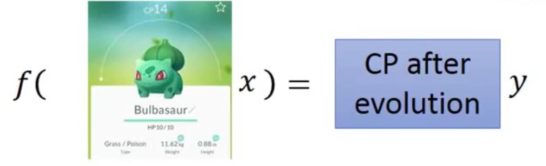 -->
<!--  -->

- Step1：模型搭建（线性模型 y=w*x+b，w为权重，b为偏置）

<!-- 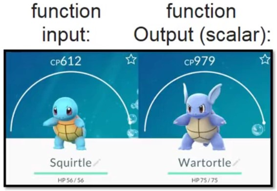 -->

Training Data：x表示原始CP值，y表示进化后CP值

- Step2：模型Function评估（Loss Function）

  

  
  

  Loss Function：input为某一个function，output为该function的好坏

- Step3：Best Function（从Function set中选出最好的一个Function，即选择损失函数值最小）

## 如何找出Best Function？Gradient Descent

- 穷举法：遍历曲线所有值，找到L(w)最小值即为最优解（效率非常低）

- 梯度下降：
  - Step1：随机选取一个初始值$w_0$
  - Step2：求解$w=w_0$时Loss的微分
    - 当斜率为负值时，w向右增大值
    - 当斜率为正值时，w向左减小值
  - Step3：设置学习率(Learning Rate)
  - 不断重复执行Step2和Step3，直到找到最小值（局部最小值）

- 梯度下降法图演示过程

    <!-- 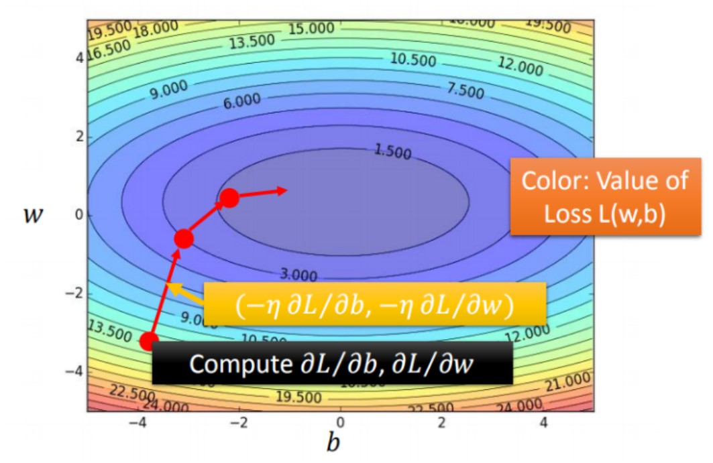 -->
    <!--  -->
    

    
    

  
  - 图中等高线对应每个Loss值，由外往里值越来越小
  - 红色箭头为对应位置等高线的法线方向

## 训练结果如何？

<!-- 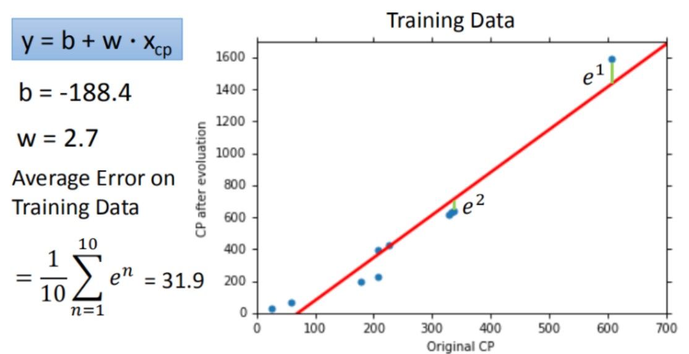 -->

计算训练数据集的平均误差来验证模型好坏，该模型在training data的平均误差为31.9

<!-- 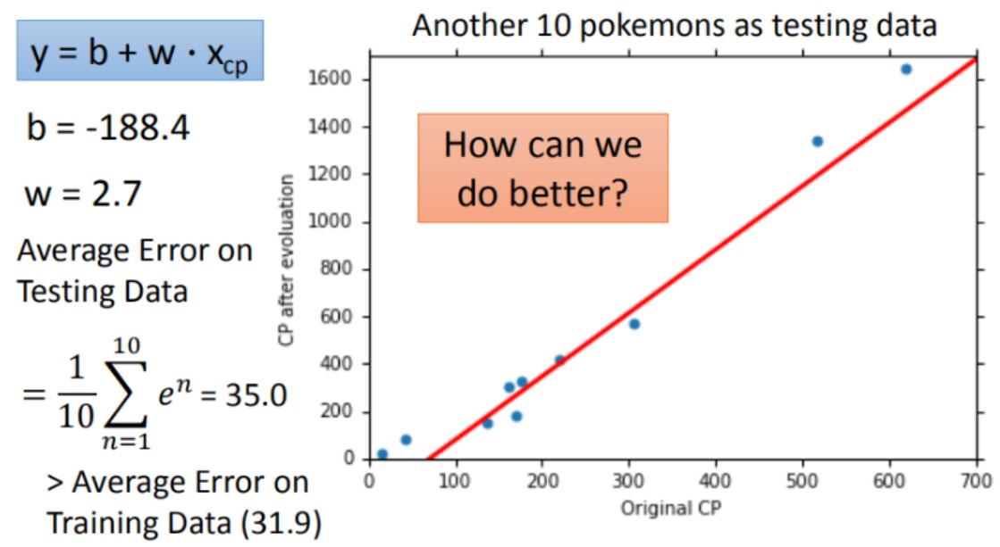 -->
<!--  -->

计算测试数据集的平均误差来验证模型好坏，该模型在testing data的平均误差为35.0

因为best function是在training data上找到的，所以在testing data的平均误差要比在训练数据集的平均误差大一点

## 引入更复杂的模型：一元N次线性模型

一元二次线性方程：$y = b + w_1*x_1 + w_2*(x_2)$2

training data的平均误差为15.4，testing data 的平均误差为18.4

## 过拟合问题

拟合问题判断标准

| 训练集表现 | 测试集表现 | 结论 |
| :-------: | :-------: | :--: |
|    好     |    不好   | 过拟合 |
|   不好    |    不好    | 欠拟合 |

<!-- 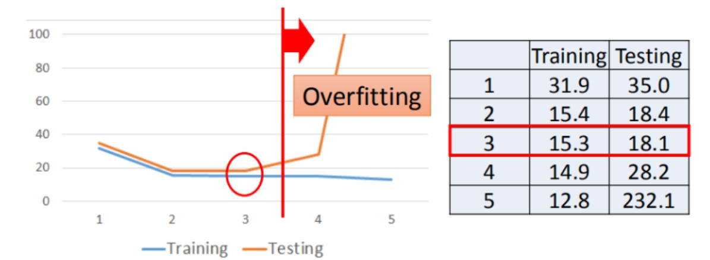 -->

数据集在不同一元N次线性方程中的平均误差（分别为一次、二次、三次、四次、五次）

training data的平均误差：31.9、15.4、15.3、14.9、12.8

testing data 的平均误差：35.0、18.4、18.1、28.8、232.1

可以看到，当使用更高次方（更复杂）的模型时，在训练集上的表现越来越优秀，但在测试集上的效果却越来越差，这就是出现了过拟合问题

说明，越复杂的模型在training data上可以有比较好的结果，但在testing data上并不总是可以带来更好的表现

## 步骤优化

<!--  -->

当我们数据集足够大时，我们发现更深的特征，不同种类Pokemon在进化前是相同CP值，但进化后CP值甚至可以相差2倍，即不同Pokemon种类会影响其进化后CP值的结果

<!-- 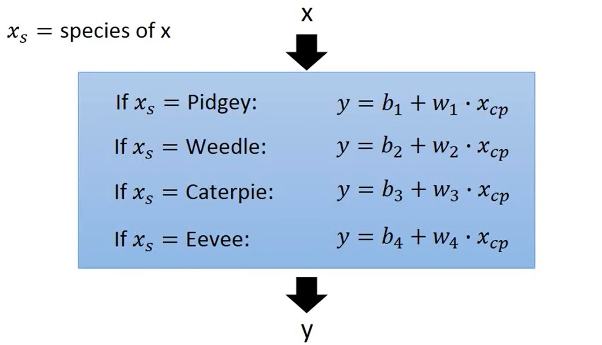 -->

- Back to Step1：重新设计Model的Function
  - 每个物种都有一个function，而且每个function的w权重和b偏置值都不一样
  - 我们将每个物种对应的function合并为一个function线性方程，即y = b + $\sum w_i x_i$

    <!-- 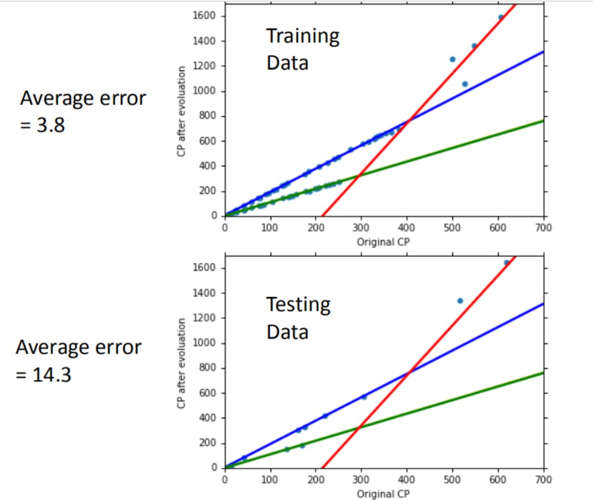 -->
    <!--  -->
    

    
    

  - 通过以上图，我们发现使用新模型，training data和testing data的平均误差值都有一定程度的下降

  <!-- 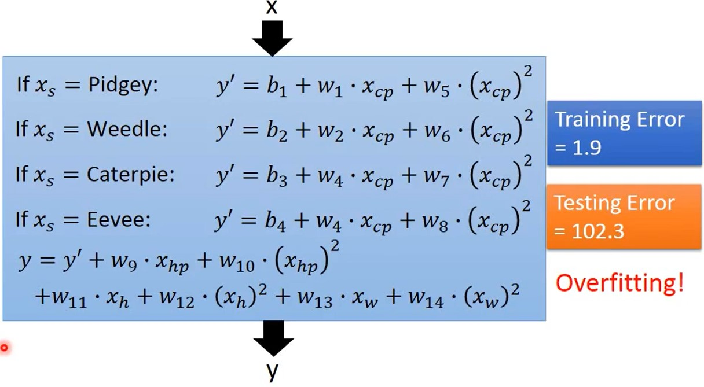 -->
  <!--  -->
  

  
  

- Back to Step1：引入更多维度的参数（Height、Weight、HP等）

  - 通过实验可以发现，引入多个特征值后，模型出现过拟合现象

- Back to Step2：Regularization（归一化），可能会以增大训练误差为代价来减小测试误差，以达到去过拟合效果

  <!-- 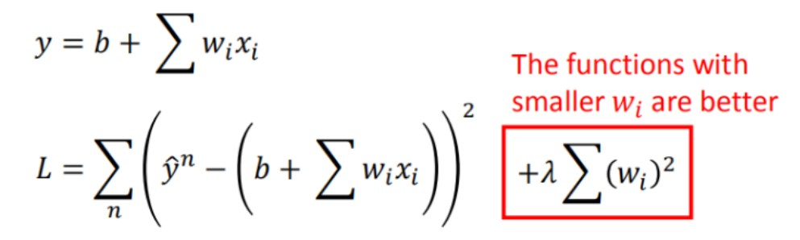 -->
  

  
  

  <!--  -->
  

  
  

  - 保留所有的特征变量，但会减小特征变量的数量级
